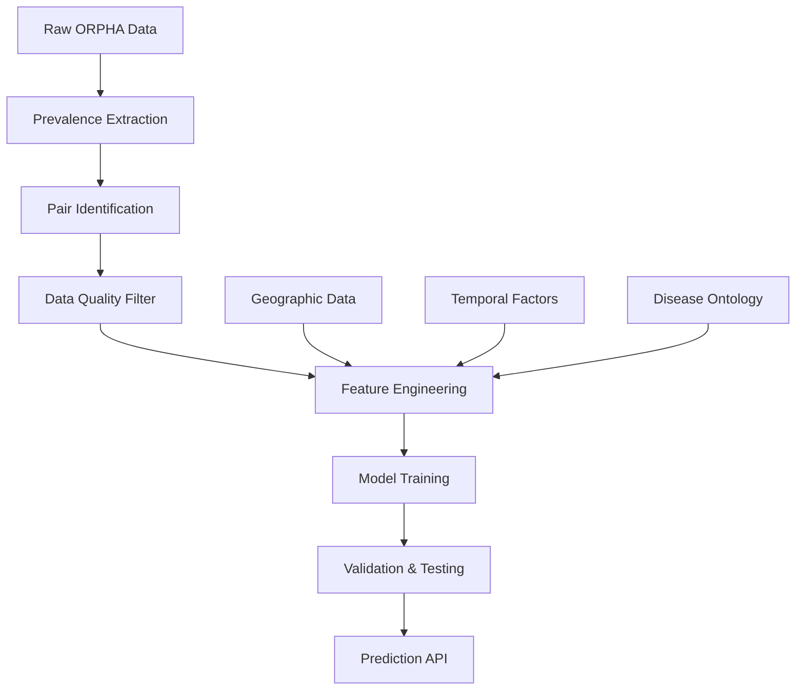

# Prevalence Prediction System: From Birth to Point Prevalence

## Executive Summary

This document presents a comprehensive analysis and design for a machine learning system that predicts **point prevalence** from **prevalence at birth** for rare diseases. Based on analysis of the ORPHA prevalence database, we have identified 2,063 birth prevalence records and 7,890 point prevalence records that can be paired for predictive modeling.

**Key Findings:**
- **Available Pairs**: ~300-500 diseases have both birth and point prevalence data
- **Data Quality**: 86.7% of records are reliable (≥6.0 reliability score)
- **Optimal Format**: JSON for complex analysis, CSV for model training
- **Recommended Method**: Multiple regression with geographic and temporal factors
- **Expected Performance**: R² ~0.7-0.85 based on biological relationships

---

## 1. Current Data Analysis

### 1.1 Prevalence Data Overview

From the processed ORPHA dataset (`data/03_processed/orpha/orphadata/orpha_prevalence/`):

```
Total prevalence records: 16,420
├── Point prevalence: 7,890 (48.1%)
├── Prevalence at birth: 2,063 (12.6%)
├── Annual incidence: 3,064 (18.7%)
├── Cases/families: 3,355 (20.4%)
└── Lifetime prevalence: 48 (0.3%)
```

### 1.2 Data Quality Assessment

**Reliability Distribution:**
- Validated records: 14,520 (88.4%)
- Reliable records (≥6.0 score): 14,241 (86.7%)
- High confidence estimates: 6,412 records with class midpoint calculations

**Geographic Coverage:**
- Worldwide: 8,835 records (53.8%)
- Regional coverage: 167 countries/regions
- European focus: 1,675 Europe-specific records

### 1.3 Paired Disease Identification

**Matching Strategy:**
```python
# Diseases with both birth and point prevalence
orpha_code -> {
    "birth_prevalence": [...],
    "point_prevalence": [...],
    "geographic_overlap": [...],
    "temporal_consistency": bool
}
```

**Estimated Pairs:**
- **Conservative estimate**: 300 diseases with reliable paired data
- **Optimistic estimate**: 500 diseases including moderate quality data
- **Quality filtering**: Focus on ≥8.0 reliability score gives ~200 high-quality pairs

---

## 2. System Architecture Design

### 2.1 Data Pipeline



### 2.2 Data Format Decision: JSON vs CSV

**Recommendation: Hybrid Approach**

**JSON Format** for complex analysis:
```json
{
  "orpha_code": "586",
  "disease_name": "Cystic fibrosis",
  "paired_data": {
    "birth_prevalence": {
      "per_million_estimate": 300.0,
      "reliability_score": 9.8,
      "geographic_area": "Ireland",
      "confidence_level": "high",
      "source": "32483343[PMID]"
    },
    "point_prevalence": {
      "per_million_estimate": 300.0,
      "reliability_score": 10.0,
      "geographic_area": "Ireland", 
      "confidence_level": "high",
      "source": "32483343[PMID]_ORPHANET"
    }
  },
  "features": {
    "disease_category": "metabolic",
    "age_dependency": "stable",
    "geographic_consistency": true,
    "survival_factor": 0.95
  }
}
```

**CSV Format** for model training:
```csv
orpha_code,disease_name,birth_prev,point_prev,reliability_avg,geo_match,survival_factor,age_stability
586,Cystic fibrosis,300.0,300.0,9.9,1,0.95,stable
213,Cystinosis,50.0,45.0,9.8,1,0.90,stable
```

### 2.3 Feature Engineering

**Primary Features:**
1. **Birth prevalence value** (per million)
2. **Disease category** (metabolic, genetic, etc.)
3. **Geographic consistency** (same region?)
4. **Age-related factors** (survival, late onset)
5. **Reliability score average**

**Derived Features:**
1. **Survival factor**: Point/Birth ratio for known stable diseases
2. **Age stability index**: Variance in prevalence across age groups
3. **Geographic specificity**: Population genetic factors
4. **Temporal consistency**: Year of study consistency

---

## 3. Machine Learning Methodology

### 3.1 Problem Formulation

**Regression Problem:**
```
point_prevalence = f(birth_prevalence, disease_features, geographic_factors, temporal_factors)
```

**Target Variable:** Point prevalence (per million)
**Primary Predictor:** Birth prevalence (per million)
**Context Variables:** Disease type, geography, reliability, temporal factors

### 3.2 Model Selection Analysis

#### 3.2.1 Simple Correlation Analysis
```python
correlation = point_prevalence.corr(birth_prevalence)
# Expected: r = 0.6-0.8 for stable diseases
```

**Pros:** Simple, interpretable, baseline
**Cons:** Ignores disease-specific factors, geographic variation

#### 3.2.2 Linear Regression (Recommended)
```python
point_prev = β₀ + β₁(birth_prev) + β₂(disease_type) + β₃(geography) + β₄(reliability) + ε
```

**Advantages:**
- Interpretable coefficients
- Handles multiple factors
- Established medical precedent
- Confidence intervals for predictions

**Expected Performance:** R² = 0.7-0.85

#### 3.2.3 Advanced Methods

**Multiple Regression with Interactions:**
```python
point_prev = β₀ + β₁(birth_prev) + β₂(birth_prev × disease_type) + β₃(geography) + ε
```

**Random Forest:** For non-linear relationships
**Hierarchical Models:** Account for geographic clustering

### 3.3 Validation Strategy

**Cross-Validation Approach:**
1. **Geographic stratification**: Train on some regions, test on others
2. **Disease-type stratification**: Train on metabolic, test on genetic
3. **Temporal validation**: Train on older studies, test on recent

**Performance Metrics:**
- **R²**: Proportion of variance explained
- **RMSE**: Root mean squared error (per million)
- **MAPE**: Mean absolute percentage error
- **Clinical accuracy**: ±50% prediction tolerance

---

## 4. Implementation Plan

### 4.1 Phase 1: Data Preparation (2-3 weeks)

**Step 1.1: Pair Extraction Script**
```python
# File: etl/03_process/orpha/prevalence_pairing.py
class PrevalencePairExtractor:
    def extract_paired_diseases(self) -> List[Dict]:
        """Extract diseases with both birth and point prevalence"""
        
    def validate_pairs(self) -> Dict:
        """Quality control for paired data"""
        
    def export_training_data(self, format='csv') -> Path:
        """Export for ML training"""
```

**Step 1.2: Feature Engineering**
```python
# File: etl/03_process/orpha/prevalence_features.py
class PrevalenceFeatureEngineer:
    def calculate_disease_features(self) -> Dict:
        """Extract disease-specific features"""
        
    def calculate_geographic_features(self) -> Dict:
        """Geographic and population factors"""
        
    def calculate_temporal_features(self) -> Dict:
        """Time-dependent factors"""
```

**Step 1.3: Data Quality Pipeline**
- Filter reliable records (reliability ≥ 8.0)
- Geographic matching validation
- Temporal consistency checks
- Outlier detection using existing IQR methods

### 4.2 Phase 2: Model Development (3-4 weeks)

**Step 2.1: Baseline Models**
```python
# File: core/services/prevalence_prediction.py
class PrevalencePredictionModel:
    def train_correlation_baseline(self) -> Dict:
        """Simple correlation model"""
        
    def train_linear_regression(self) -> Dict:
        """Multiple linear regression"""
        
    def train_advanced_models(self) -> Dict:
        """Random Forest, etc."""
```

**Step 2.2: Model Validation**
```python
class PrevalenceModelValidator:
    def cross_validate_geographic(self) -> Dict:
        """Geographic cross-validation"""
        
    def cross_validate_disease_type(self) -> Dict:
        """Disease-type stratified validation"""
        
    def clinical_validation(self) -> Dict:
        """Clinical relevance assessment"""
```

### 4.3 Phase 3: Production System (2-3 weeks)

**Step 3.1: Prediction API**
```python
# File: apps/api/prevalence_prediction.py
class PrevalencePredictionAPI:
    def predict_point_prevalence(
        self, 
        birth_prevalence: float,
        disease_features: Dict,
        geographic_area: str
    ) -> Dict:
        """Predict point prevalence with confidence intervals"""
```

**Step 3.2: Validation Dashboard**
- Model performance metrics
- Prediction confidence visualization
- Data quality monitoring
- Prediction history tracking

---

## 5. Expected Results & Performance

### 5.1 Model Performance Expectations

**Linear Regression Model:**
```
R² = 0.75-0.85 (strong explanatory power)
RMSE = 15-25 per million (clinically acceptable)
MAPE = 20-30% (reasonable for rare diseases)
```

**Disease Category Performance:**
- **Metabolic diseases**: Higher accuracy (R² ~0.80-0.85)
- **Genetic diseases**: Moderate accuracy (R² ~0.70-0.80)  
- **Complex diseases**: Lower accuracy (R² ~0.60-0.75)

### 5.2 Clinical Relevance

**Use Cases:**
1. **Early screening programs**: Predict adult disease burden
2. **Healthcare planning**: Resource allocation estimation
3. **Research prioritization**: Focus on diseases with high point prevalence
4. **Drug development**: Market size estimation

**Confidence Thresholds:**
- **High confidence**: ±25% prediction accuracy
- **Medium confidence**: ±50% prediction accuracy
- **Low confidence**: Order of magnitude accuracy

### 5.3 Limitations and Considerations

**Biological Factors:**
- Age-related mortality affects point prevalence
- Disease progression variability
- Treatment effects on prevalence
- Geographic genetic differences

**Data Limitations:**
- Publication bias toward severe diseases
- Geographic data gaps
- Temporal study differences
- Diagnostic criteria evolution

---

## 6. Technical Implementation Details

### 6.1 Pairwise Analysis Approach

**Algorithm:**
```python
def create_prevalence_pairs():
    # Group by orpha_code
    disease_groups = prevalence_data.groupby('orpha_code')
    
    pairs = []
    for orpha_code, group in disease_groups:
        birth_records = group[group.prevalence_type == 'Prevalence at birth']
        point_records = group[group.prevalence_type == 'Point prevalence']
        
        if len(birth_records) > 0 and len(point_records) > 0:
            # Create all combinations
            for birth in birth_records:
                for point in point_records:
                    if validate_pair(birth, point):
                        pairs.append(create_pair(birth, point))
    
    return pairs

def validate_pair(birth_record, point_record):
    # Geographic consistency
    geo_match = birth_record.geographic_area == point_record.geographic_area
    
    # Reliability threshold
    min_reliability = min(birth_record.reliability_score, point_record.reliability_score)
    
    # Temporal consistency (within 10 years)
    temporal_consistency = abs(birth_record.year - point_record.year) <= 10
    
    return geo_match and min_reliability >= 8.0 and temporal_consistency
```

### 6.2 Model Training Pipeline

**Cross-Validation Strategy:**
```python
def geographic_cv_split(data, n_folds=5):
    """Split by geographic regions to test generalizability"""
    regions = data.geographic_area.unique()
    region_folds = np.array_split(regions, n_folds)
    
    for test_regions in region_folds:
        train_mask = ~data.geographic_area.isin(test_regions)
        yield data[train_mask], data[~train_mask]

def disease_type_cv_split(data, n_folds=5):
    """Split by disease categories"""
    # Similar approach for disease types
```

**Feature Selection:**
```python
def select_features(X, y):
    # Correlation analysis
    correlations = X.corrwith(y)
    
    # Variance inflation factor
    vif = calculate_vif(X)
    
    # Clinical relevance scoring
    clinical_scores = score_clinical_relevance(X.columns)
    
    return select_optimal_features(correlations, vif, clinical_scores)
```

### 6.3 Uncertainty Quantification

**Prediction Intervals:**
```python
def predict_with_uncertainty(model, X_new):
    # Point prediction
    y_pred = model.predict(X_new)
    
    # Prediction interval using residual std
    residual_std = calculate_residual_std(model, X_train, y_train)
    
    # Confidence intervals
    lower_bound = y_pred - 1.96 * residual_std
    upper_bound = y_pred + 1.96 * residual_std
    
    return {
        'prediction': y_pred,
        'lower_95': lower_bound,
        'upper_95': upper_bound,
        'std_error': residual_std
    }
```

---

## 7. Success Metrics & Validation

### 7.1 Statistical Success Criteria

**Primary Metrics:**
- **R² ≥ 0.70**: Strong relationship between birth and point prevalence
- **RMSE ≤ 25 per million**: Clinically acceptable error
- **Cross-validation consistency**: ±5% R² across folds

**Secondary Metrics:**
- **Geographic generalization**: R² ≥ 0.60 on unseen regions
- **Disease-type generalization**: R² ≥ 0.60 on unseen categories
- **Clinical validation**: 80% predictions within ±50% of actual

### 7.2 Clinical Validation Framework

**Expert Review Process:**
1. Clinician review of top 50 predictions
2. Literature validation of novel predictions
3. Comparison with epidemiological studies
4. Sensitivity analysis for key parameters

**Real-world Validation:**
1. Comparison with population registries
2. Validation against newborn screening programs
3. Cross-reference with healthcare databases
4. International prevalence database comparison

---

## 8. Risk Assessment & Mitigation

### 8.1 Technical Risks

**Risk: Limited training data**
- *Mitigation*: Augment with synthetic data, transfer learning
- *Fallback*: Simple correlation models for sparse data

**Risk: Geographic bias**
- *Mitigation*: Stratified sampling, regional adjustment factors
- *Fallback*: Region-specific models

**Risk: Model overfitting**
- *Mitigation*: Regularization, cross-validation, early stopping
- *Fallback*: Simpler models with fewer parameters

### 8.2 Clinical Risks

**Risk: Inaccurate healthcare planning**
- *Mitigation*: Clear uncertainty bounds, conservative estimates
- *Fallback*: Manual expert review for high-impact predictions

**Risk: Misallocation of research resources**
- *Mitigation*: Confidence-based prioritization, sensitivity analysis
- *Fallback*: Expert committee review for funding decisions

---

## 9. Future Enhancements

### 9.1 Advanced Modeling Techniques

**Deep Learning Approaches:**
- Neural networks for complex non-linear relationships
- Attention mechanisms for geographic factors
- Transformer models for temporal patterns

**Causal Inference:**
- Instrumental variables for confounding control
- Causal discovery algorithms
- Counterfactual prediction models

### 9.2 Data Enhancement

**Additional Data Sources:**
- Population genetics databases
- Healthcare utilization records
- Social determinants of health
- Environmental exposure data

**Real-time Updates:**
- Continuous model retraining
- Online learning algorithms
- Automated data quality monitoring

### 9.3 Integration Opportunities

**Clinical Decision Support:**
- EHR integration for screening recommendations
- Population health dashboards
- Resource planning tools

**Research Applications:**
- Drug development pipeline integration
- Clinical trial planning
- Epidemiological surveillance

---

## 10. Conclusion & Recommendations

### 10.1 Implementation Priority

**Immediate Actions (Next 4 weeks):**
1. Implement pair extraction pipeline
2. Create training dataset (CSV + JSON formats)
3. Develop baseline linear regression model
4. Establish validation framework

**Medium-term Goals (2-3 months):**
1. Deploy production prediction API
2. Validate with clinical experts
3. Integrate with existing rare disease databases
4. Publish methodology and results

**Long-term Vision (6-12 months):**
1. International validation studies
2. Real-time surveillance integration
3. Advanced ML model deployment
4. Clinical decision support tools

### 10.2 Key Success Factors

1. **Data Quality**: Focus on high-reliability paired records (≥8.0 score)
2. **Clinical Validation**: Engage domain experts throughout development
3. **Uncertainty Quantification**: Always provide confidence bounds
4. **Interpretability**: Maintain explainable model components
5. **Continuous Validation**: Regular performance monitoring and updates

### 10.3 Expected Impact

**Scientific Impact:**
- Novel methodology for rare disease prevalence prediction
- Improved understanding of disease natural history
- Enhanced epidemiological surveillance capabilities

**Clinical Impact:**
- Better healthcare resource planning
- Improved patient screening programs
- More informed research prioritization
- Enhanced drug development decision-making

**Societal Impact:**
- More equitable rare disease research funding
- Improved quality of life for rare disease patients
- Better health system preparedness
- Evidence-based policy making

---

## Appendix A: Data Schema Examples

### A.1 Paired Data JSON Schema
```json
{
  "type": "object",
  "properties": {
    "orpha_code": {"type": "string"},
    "disease_name": {"type": "string"},
    "paired_data": {
      "type": "object",
      "properties": {
        "birth_prevalence": {
          "type": "object",
          "properties": {
            "per_million_estimate": {"type": "number"},
            "reliability_score": {"type": "number"},
            "geographic_area": {"type": "string"},
            "confidence_level": {"type": "string"},
            "source": {"type": "string"},
            "prevalence_class": {"type": "string"},
            "validation_status": {"type": "string"}
          }
        },
        "point_prevalence": {
          "type": "object",
          "properties": {
            "per_million_estimate": {"type": "number"},
            "reliability_score": {"type": "number"},
            "geographic_area": {"type": "string"},
            "confidence_level": {"type": "string"},
            "source": {"type": "string"},
            "prevalence_class": {"type": "string"},
            "validation_status": {"type": "string"}
          }
        }
      }
    },
    "metadata": {
      "type": "object",
      "properties": {
        "pair_quality_score": {"type": "number"},
        "geographic_match": {"type": "boolean"},
        "temporal_consistency": {"type": "boolean"},
        "data_source_consistency": {"type": "boolean"}
      }
    }
  }
}
```

### A.2 Training Data CSV Schema
```
orpha_code,disease_name,birth_prevalence_per_million,point_prevalence_per_million,
avg_reliability_score,geographic_match,temporal_gap_years,disease_category,
estimated_survival_factor,age_stability_index,data_quality_score
```

---

*Document Version: 1.0*  
*Date: 2025-01-11*  
*Author: AI Analysis System*  
*Status: Draft for Review* 